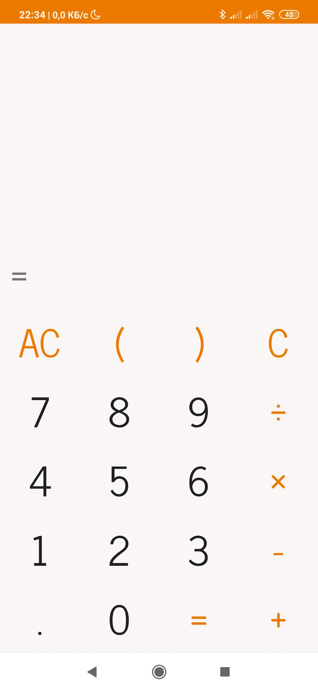

# Calculator
This is just normal calculator

## Used languages and technologies:
1. Java
1. Kotlin
1. XML
1. Regular expression
1. Android studio
1. [Shunting-yard algorithm]

## How to download it?
- I don't know :)

## How is it works
At first, I used [Shunting-yard algorithm] that's why it possible to use brackets and correctly calculate with priority of operations.
For reorganization text from expression I used regex`(\\()|(\\))|([*\\/])|(?:(?<=[\\d\\)])\\ *)([+-])|(\\-?\\ *[\\d.]+)|(\\S)` it separated symbols into *six* groups.

[Shunting-yard algorithm]: https://en.m.wikipedia.org/wiki/Shunting-yard_algorithm
